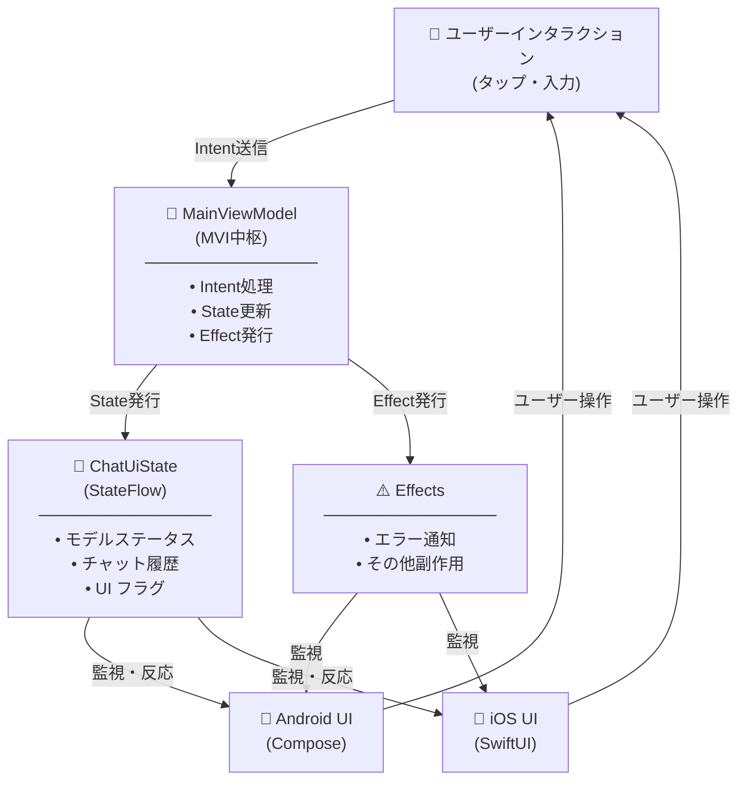
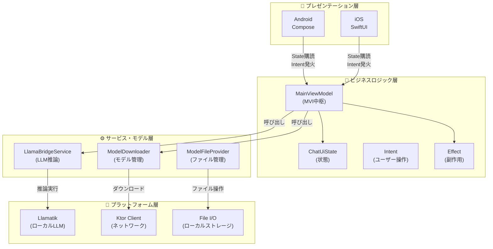

# KMP LLM デモンストレーション

**Kotlin Multiplatform Mobile (KMP)** でのローカルLLM推論機能を備えたクロスプラットフォーム AI チャットアプリケーションです。Android・iOS 両プラットフォームで動作します。

## 概要

このプロジェクトは、プラットフォーム固有のビジネスロジックを共有しながら、各プラットフォーム用のネイティブ UI を構築するモダンなアプローチを実践しています。**Gemma-4** を使用したローカルLLM推論により、クラウド接続なしでプライベートなチャット体験を実現します。

**主な機能：**
- 🤖 Llamatik を使用したローカルLLM推論（オフライン対応）
- 📱 iOS と Android のネイティブ UI
- 🔄 リアルタイムテキスト生成（ストリーミング対応）
- 💾 チャット履歴管理
- ⚙️ GPU アクセラレーション対応
- 🎨 Material Design 3 / iOS ネイティブデザイン

## アーキテクチャ設計

本プロジェクトは **MVI（Model-View-Intent）パターン** を採用し、単方向のデータフローで状態変更と副作用を管理します。

### MVI パターン（データフロー）



**MVI パターンの特徴：**
- **Model**：`ChatUiState` が UI の単一の情報源
- **View**：`Compose` (Android) / `SwiftUI` (iOS) が State を監視
- **Intent**：ユーザー操作を明示的にクラス化（メッセージ送信、GPU 切り替えなど）

### レイヤー構成（全体アーキテクチャ）



**各レイヤーの役割：**

| レイヤー | 責務 | 主要クラス |
|---------|------|----------|
| **プレゼンテーション** | UI レンダリング、イベント処理 | `MainScreen.kt` (Compose)、`MainViewModel.swift` (SwiftUI) |
| **ビジネスロジック** | 状態管理、データフロー制御 | `MainViewModel`、`ChatUiState`、`Intent`、`Effect` |
| **サービス・モデル** | ドメインロジック、外部連携 | `LlamaBridgeService`、`ModelDownloader`、`ModelFileProvider` |
| **プラットフォーム** | ネイティブ API、OS依存処理 | `Llamatik`、`Ktor`、`FileI/O` |

## 技術スタック

### コアフレームワーク
- **Kotlin Multiplatform Mobile (KMP)** - 共有ビジネスロジック (2.3.21)
- **Compose Multiplatform** (1.11.0) - Android UI フレームワーク
- **SwiftUI** + **SKIE** (0.10.12) - iOS 統合レイヤー

### LLM・モデル管理
- **Llamatik** (1.7.0) - ローカルLLM推論エンジン（GGUF形式対応）
- **Kotlin Coroutines** (1.10.1) - 非同期テキストストリーミング

### 状態管理・DI
- **Arrow** (2.0.0) - 関数型プログラミング用ユーティリティ（`Either`、`Option`、`Ior`）
- **Koin** (4.2.0) - 依存性注入コンテナ
- **AndroidX Lifecycle** (2.11.0-beta01) - ViewModel・ライフサイクル管理

### ネットワーク
- **Ktor Client** (3.1.3) - HTTP クライアント
  - `ktor-client-okhttp` (Android)
  - `ktor-client-darwin` (iOS)

### デザイン
- **Material Design 3** (1.11.0-alpha07)
- **Material Icons** (1.7.3)

## プロジェクト構成

```
.
├── shared/                           # マルチプラットフォームモジュール
│   ├── src/commonMain/kotlin/
│   │   ├── viewModel/
│   │   │   ├── MainViewModel.kt      # MVI状態マシン
│   │   │   ├── ChatUiState.kt        # 状態モデル定義
│   │   │   ├── Intent.kt             # ユーザー操作
│   │   │   └── Effect.kt             # 副作用定義
│   │   ├── LlamaBridgeService.kt     # LLM推論ラッパー
│   │   ├── model/
│   │   │   ├── LlamaModel.kt         # モデル定義
│   │   │   ├── ModelDownloader.kt    # ダウンロード・キャッシュ
│   │   │   └── ModelFileProvider.kt  # ファイルI/O抽象化
│   │   └── di/
│   │       ├── CommonModule.kt       # 共通DI設定
│   │       └── PlatformModule.kt     # プラットフォーム別DI設定
│   └── build.gradle.kts
│
├── androidApp/                       # Android モジュール
│   ├── src/main/kotlin/
│   │   ├── ui/
│   │   │   ├── screen/MainScreen.kt  # メイン画面 (Compose)
│   │   │   ├── component/            # 再利用可能なコンポーネント
│   │   │   └── theme/                # Material Design 3 テーマ
│   │   ├── KmpLlmApp.kt              # アプリ構成ルート
│   │   └── MainActivity.kt            # エントリーポイント
│   └── build.gradle.kts
│
├── iosApp/                           # iOS モジュール
│   ├── KMPLLMdemonstration/
│   │   ├── UI/
│   │   │   └── MainViewModel.swift   # SwiftUI ViewModel 橋渡し
│   │   └── App.swift                 # SwiftUI アプリルート
│   └── project.pbxproj
│
├── build.gradle.kts                  # ルート Gradle 設定
├── settings.gradle.kts
└── gradle/libs.versions.toml         # バージョン管理
```

## セットアップ手順

### 必須要件
- Android Studio (Gradle 9.0+)
- Xcode 15+ (iOS 開発用)
- Kotlin 2.3.21
- 最小 SDK：Android 31、iOS 14+

### Android のセットアップ
1. Android Studio でプロジェクトを開く
2. Gradle ファイルを同期
3. 実機/エミュレータで実行：
   ```bash
   ./gradlew :androidApp:installDebug
   ```

### iOS のセットアップ
1. Xcode で `iosApp/KMPLLMdemonstration.xcodeproj` を開く
2. `Local.xcconfig` でチームIDを設定
3. シミュレータ/実機でビルド・実行

### モデルのダウンロード
初回起動時に **Gemma-4 E2B モデル**（3.15 GB）が自動ダウンロードされます。セットアップ後、ロゴをタップするとダウンロードを手動トリガーできます。

## 主要な設計判断

### MVI パターンの採用
**理由**：単方向データフローにより、状態変更を予測可能・テスト容易にする

**効果**：関心の分離が明確、状態変更の追跡が簡単

### Arrow による関数型プログラミング
**理由**：`Option`・`Either` 型で null チェックと明示的なエラー処理

**効果**：型安全性向上、網羅性チェックの強化

### Llamatik によるローカル推論
**理由**：プライベート保護、ネットワーク不要、オフライン動作

**効果**：低レイテンシ、リアルタイムストリーミング対応

### プラットフォーム間での ViewModel 共有
**理由**：MVVM アプローチでビジネスロジック重複を防止

**効果**：チャット状態・LLM 制御の単一情報源

## コード例

### Intent のディスパッチ
```kotlin
// ユーザーがメッセージを送信
viewModel.dispatch(Intent.Main.UpdateInput("こんにちは"))
viewModel.dispatch(Intent.Main.Send)
```

### 状態の監視 (Android/Compose)
```kotlin
val state by viewModel.state.collectAsStateWithLifecycle()
LazyColumn {
    items(state.turns) { turn ->
        TurnItem(turn)
    }
}
```

### テキスト生成の処理
```kotlin
// MainViewModel 内
llamaBridgeService.generateText(prompt).collect { result ->
    result.getOrNull()?.let { genState ->
        val text = when (genState) {
            is GenTextState.OnProgress -> genState.value  // ストリーミング中
            is GenTextState.Complete -> genState.value    // 完了
        }
        updateTurnResponse(turnId, text)
    }
}
```

## 設計フィロソフィ：LT デモアプリとしての軽量アーキテクチャ

### テキストストリーミングの UX 価値

このプロジェクトの核は **テキストストリーミング生成** です。LT では以下を強調します：

> **「ストリーミングをするだけで、LLM 推論の体感を劇的に早くできる」**

**エンジニア視点** 💻
- `LlamaBridgeService.generateText()` でトークン単位のストリーミング配信を実装
- `callbackFlow` で非同期に結果を流す
- UI が即座に更新される

**デザイナー / ユーザー視点** 🎨（こちらが重要！）
- 推論の完了を待つのではなく、**リアルタイムで文字が現れる感覚**
- "ローディング中..."の静寂ではなく、**生成プロセスを見守ることができる**
- 同じ技術でも「ストリーミングあり」と「ストリーミングなし」では体感速度が大きく異なる
- **デザイナー的には「喉から手が出る UX 改善」**

実装詳細は [LlamaBridgeService.kt](./shared/src/commonMain/kotlin/com/example/kmpllmdemonstration/LlamaBridgeService.kt) を参照。

### 軽量アーキテクチャの選択理由

このプロジェクトは「LT で技術を説明する」デモ教材です。以下を意識的に簡潔にしています：

**省略した要素（テスト不要）：**
- ❌ Unit Test / Integration Test / UI Test
- ❌ エラーハンドリング（リトライロジック、タイムアウト）
- ❌ 永続化層（チャット履歴 DB）
- ❌ ネットワークキャッシング、分析ログ

**結果：**
- 共有コード 26 ファイル・112KB の軽量構成
- 技術スタックの本質に集中できる
- 初学者も全体像を把握しやすい

**本番化への拡張ポイント：**
| 機能 | 本番での考慮事項 |
|-----|--------------|
| **テスト** | ViewModel のロジックテスト、UI 自動テスト、結合テスト |
| **DB** | チャット履歴の永続化（Room / SQLite） |
| **エラー処理** | 詳細な例外処理、ユーザーへのフィードバック |
| **ネットワーク** | ダウンロードの再開機能、タイムアウト処理 |
| **分析** | クラッシュレポート、ユーザー行動ログ |

### その他の UI/UX 設計意図

コードを読むことと、**実際にアプリを使ってみることの両方が有効** です。

このプロジェクトの細部には、多くの UX 設計判断が埋め込まれています：

- **コード** で実装を理解することも大切です。
- **実際に触って、使ってもらって、感じてみて下さい。**

## 将来の拡張予定
- [ ] 複数モデル対応とアプリ内での切り替え機能
- [ ] ローカルデータベースへのチャット履歴保存
- [ ] 音声入出力機能
- [ ] カスタムシステムプロンプト設定
- [ ] モデル圧縮レベルの UI 選択
- [ ] モデルの事前バンドルによるオフライン対応

## 参考資料
- [Kotlin Multiplatform ドキュメント](https://kotlinlang.org/docs/multiplatform.html)
- [Compose Multiplatform 公式サイト](https://www.jetbrains.com/help/kotlin-multiplatform-dev/compose-multiplatform.html)
- [Llamatik GitHub](https://github.com/llamatik/llamatik)
- [Arrow Documentation](https://arrow-kt.io/)

## ライセンス
Apache License 2.0 - [LICENSE](./LICENSE) ファイルを参照してください

このプロジェクトは、すべての依存ライブラリが Apache 2.0 でライセンスされています。

## お問い合わせ
このプロジェクトに関するご質問は、GitHub の Issue でお気軽にお問い合わせください。
